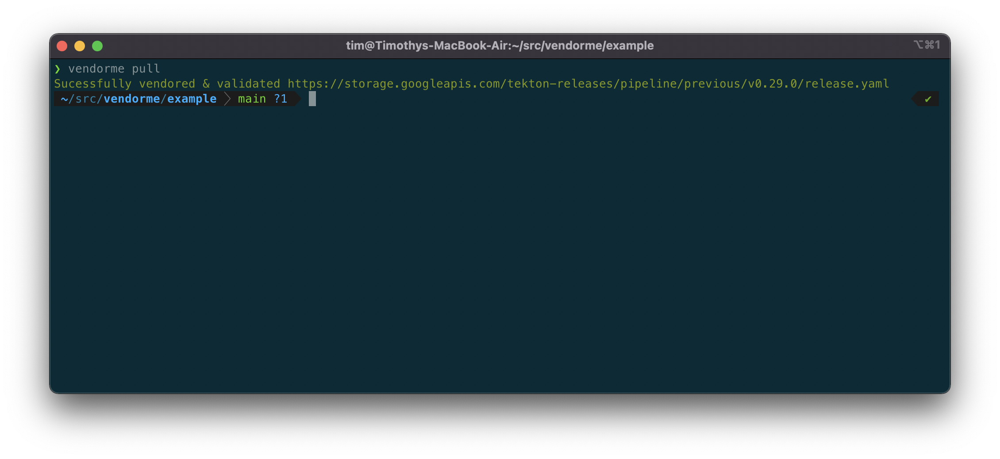

# vendorme

Vendorme is a tool that makes vendoring your project easier to do.  It improves the developer workflow by giving you one single place to manage any vendored dependencies, and ensures that those are validated properly to improve the security around your supply chain.

TODO: Screen shot

## Installation

With go 1.16 installed, run

`go install github.com/trmiller/vendorme@latest`

## How it works

Vendorme takes a basic definition of what you want to vendor, and how to validate it.  It will then go through your file - see [example](example/vendor.yaml)

Currently it only supports [rekor](github.com/sigstore/rekor) validations.  

## Useage

`vendorme pull` will default to looking for a **vendor.yaml**

  

otherwise `vendorme pull yourvendorfile.yaml`
